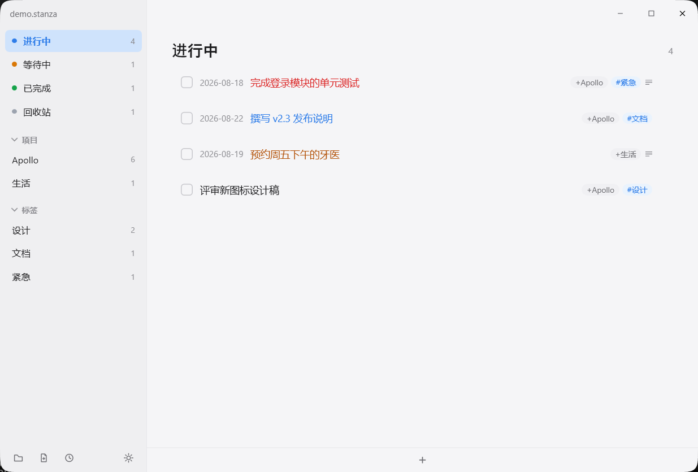
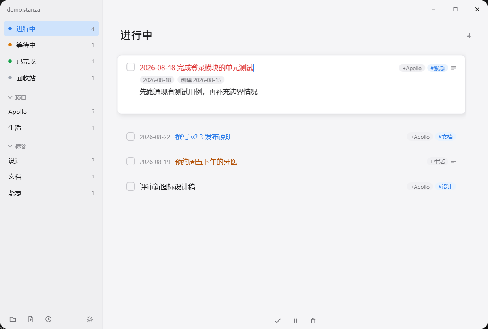
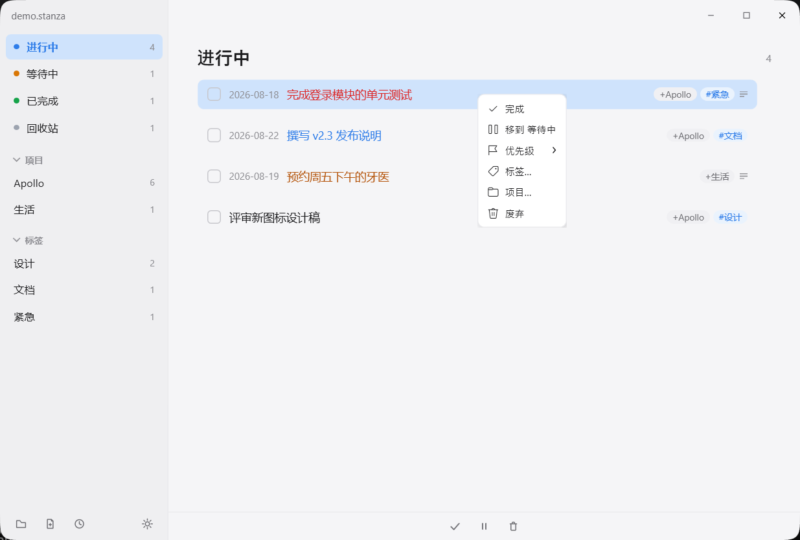
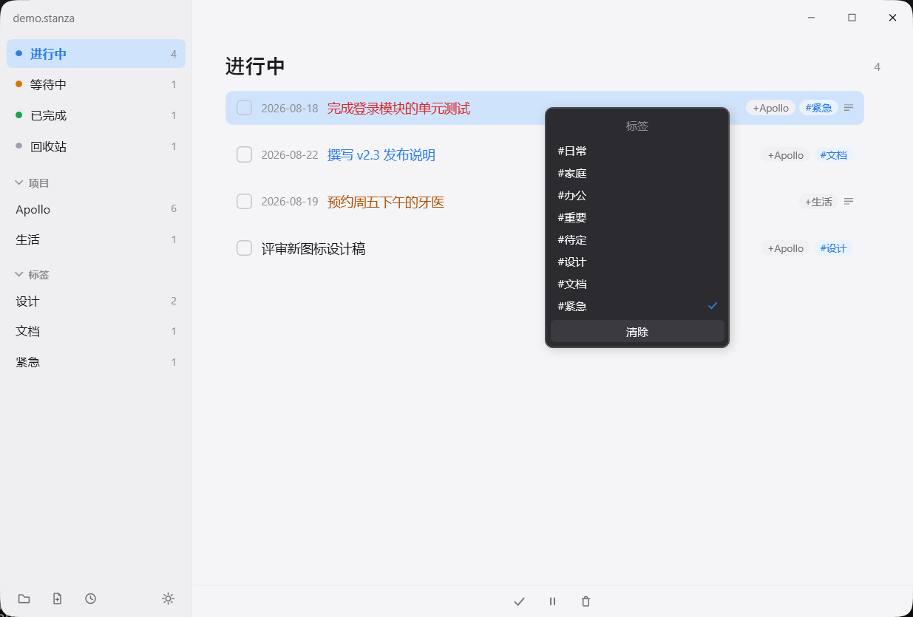

# Stanza

Stanza 是受 [TODO.txt](http://todotxt.org/) 启发的纯文本任务管理格式：整个任务列表存放在一个 UTF-8 纯文本文件中，通过状态区块（DOING / WAIT / DONE / DELETE）划分任务生命周期，通过段落式任务承载结构化元数据与自由备注。单文件、纯文本、无锁定。

本仓库是 Stanza 格式规范与官方工具的 monorepo：

| 目录 | 说明 |
| ---- | ---- |
| [stanza-rfc](stanza-rfc) | 格式规范（当前版本 RFC 1.5.0，草案状态） |
| [stanza-wpf](stanza-wpf) | Windows 桌面编辑器（WPF + MVVM，.NET 10，零第三方依赖） |
| [stanza-vscode](stanza-vscode) | VS Code 语言支持插件（语法高亮、代码片段、备注折叠） |

## 格式速览

```stanza
# DOING

(A) 2026-08-18 完成登录模块的单元测试 +Apollo #紧急
    2026-08-15 创建
    先跑通现有测试用例，再补充边界情况

# DONE

2026-08-15 修复列表页滚动卡顿的问题 +Apollo
    2026-08-14 创建
    2026-08-15 完成
    已合入主干，随 2.3 版本发布
```

- **状态区块**：`# DOING`、`# WAIT`、`# DONE`、`# DELETE` 四种标题行把文件分成进行、等待、完成、回收站四个区域。
- **任务段落**：每条无缩进的非空白行开启一个新任务，其下的缩进行是该任务的备注续行。
- **主行元数据**：行首依次是可选的优先级（四象限字母 `(A)`–`(D)`）与截止日期 `YYYY-MM-DD`，描述中内嵌至多一个 `+项目` 和零至多个 `#标签`。
- **时间戳行**：续行中整行匹配「日期 + 关键字」（创建/完成）的行，记录任务的创建与完成时间。

完整规则见 [Stanza RFC 1.5.0](stanza-rfc/Stanza-RFC-1.5.0.md)，其中第 10 节为解析器实现者准备了正则、伪代码与边界测试用例。

## 桌面应用（stanza-wpf）



Windows 桌面编辑器，极简设计，结构化查看与编辑 `.stanza` 文件。侧栏按区块、项目、标签三个维度组织任务；任务卡片按优先级象限着色（A 红 → D 淡灰），右侧以 chip 展示项目与标签。

### 交互说明

**浏览与导航**：单击选中任务，方向键或 vim 键位 `hjkl` 移动选择；侧栏点击或 `Alt+1~4` 切换区块。DOING / WAIT 始终按（优先级象限 → 截止日期）自动排序，同优先级内可拖拽微调，拖拽时实时预览落点。

**编辑任务**：双击或 `Enter` 展开任务卡片，在主行内联书写元数据——`YYYY-MM-DD` 截止、`+项目`、`#标签` 会被自动识别；下方编辑纯文本备注。`Enter` / `Esc` / 点击空白处收起确认。



**任务操作**：右键任务卡片弹出菜单——完成 / 移到其他区块 / 优先级 / 标签… / 项目… / 废弃（按当前状态显示可用项），支持多选批量操作。



**标签与项目选择器**：右键菜单「标签…」「项目…」打开弹层，顶部输入框可过滤列表，输入不存在的名称按 `Enter` 新建并应用；列表中 ✓ 表示选中任务已拥有，点击切换，底部「清除」一键移除。



### 快捷键

| 按键 | 作用 |
| ---- | ---- |
| `Ctrl+O` / 拖入窗口 | 打开文件（启动时自动恢复上次文件） |
| `Ctrl+R` | 最近文件：重复按 `R` 循环高亮，松开 `Ctrl` 打开 |
| `Ctrl+Shift+N` | 新建文件 |
| `Ctrl+S` | 保存（输入停止约 1.2 秒后也会自动保存） |
| `Ctrl+N` | 新建任务 |
| `Space` | 完成选中任务 |
| `Backspace` / `Delete` | 移入回收站 / 彻底删除 |
| `Ctrl+Z` | 撤销上一步操作 |
| `Alt+1~4` | 切换 DOING / WAIT / DONE / DELETE |

完整交互文档与行为说明见 [stanza-wpf/README.md](stanza-wpf/README.md)。

### 构建与运行

```bash
cd stanza-wpf
dotnet build
dotnet run --project src/Stanza.App -- TODO.stanza   # 启动并打开文件
dotnet test                                          # 解析器测试
```

要求 .NET 10 SDK 或更高版本。发布单文件 exe：`powershell -File stanza-wpf/tools/publish.ps1`。

### 重新生成截图

`.assets/` 下的应用截图由脚本自动截取：启动应用加载演示数据（`stanza-wpf/tools/demo.stanza`），注入键鼠操作进入各交互状态，按进程所有顶层窗口的并集区域截屏。应用界面变更后重新运行即可更新本文档中的图片：

```bash
powershell -NoProfile -ExecutionPolicy Bypass -File stanza-wpf/tools/capture-screenshots.ps1
```

## VS Code 插件（stanza-vscode）

为 `.stanza` 文件提供与 RFC 严格对齐的语法高亮（区块标题、优先级、日期、项目、标签、时间戳行）、任务/时间戳代码片段和备注折叠。从 [Releases](https://github.com/soryu-ryouji/StanzaVSCode/releases) 下载 `.vsix` 安装，详见 [stanza-vscode/README.md](stanza-vscode/README.md)。
