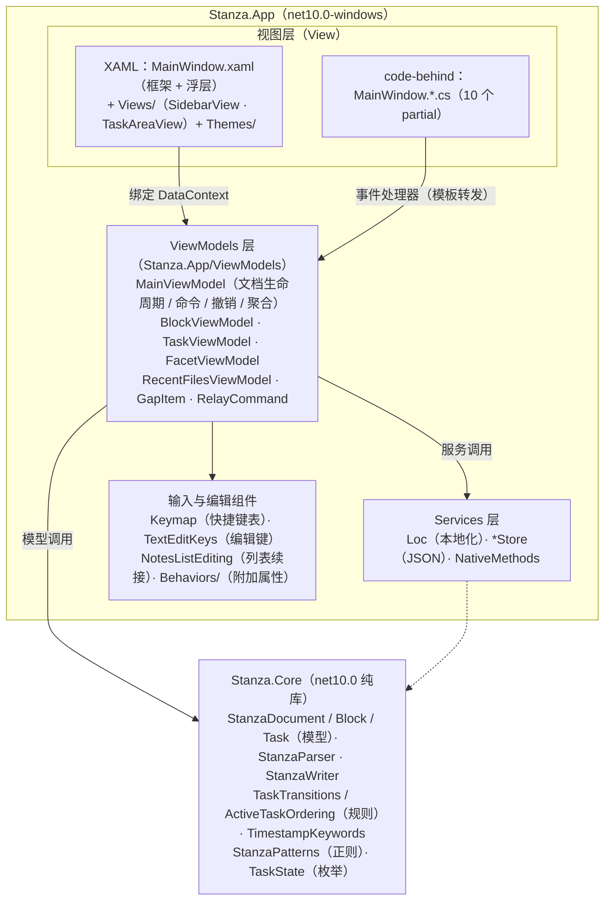
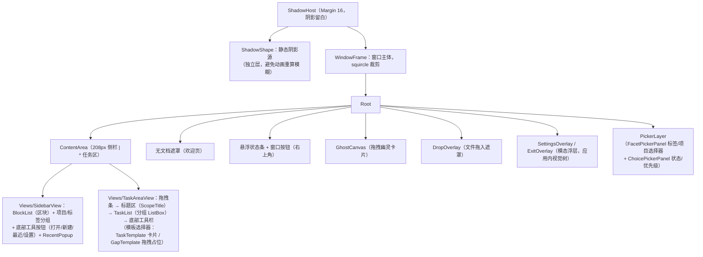
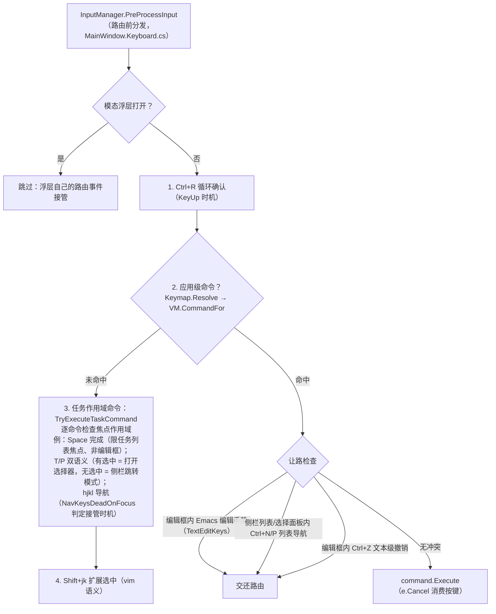
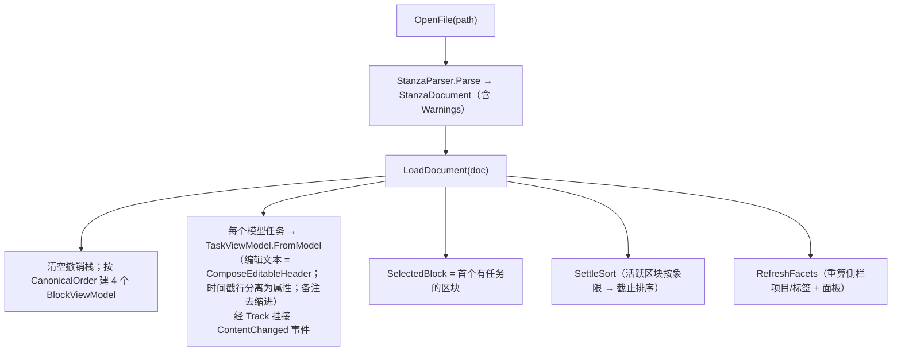
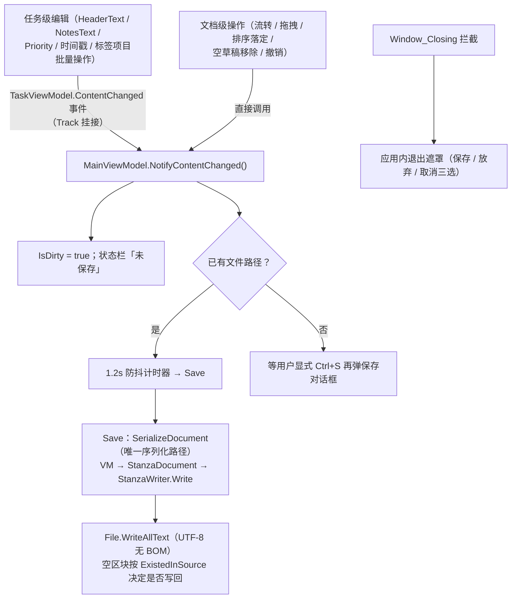
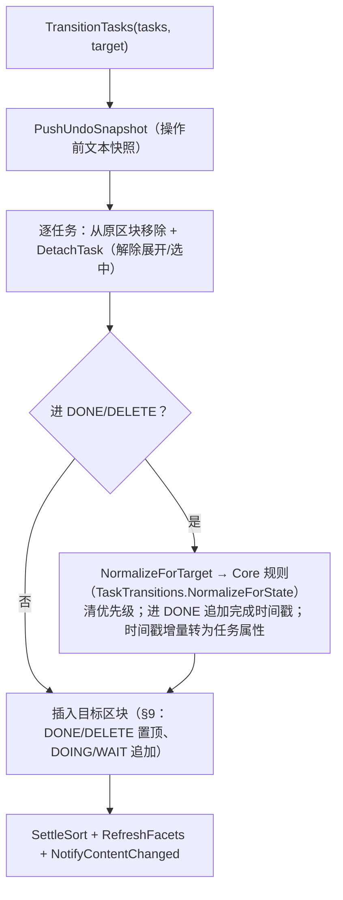
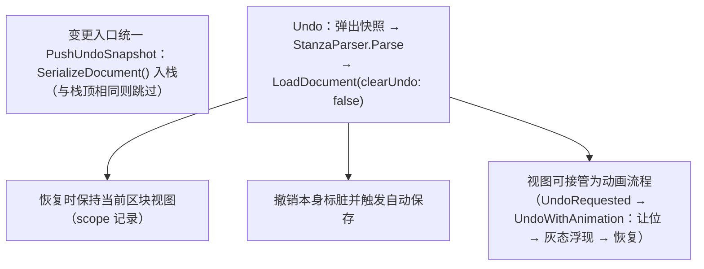
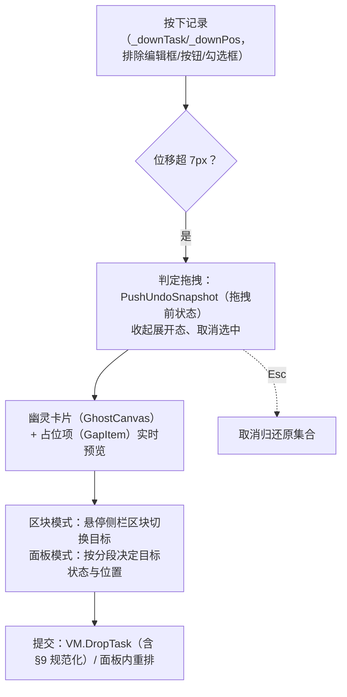
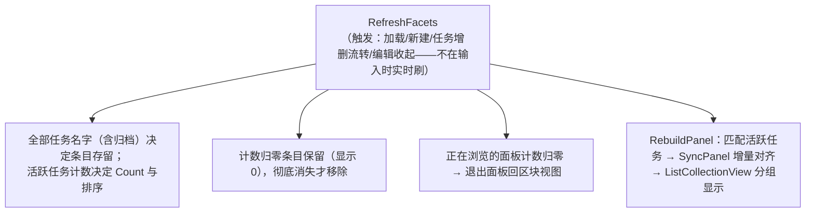

# Stanza WPF 架构文档

> 本文档面向重构场景，描述 Stanza 桌面编辑器（`stanza-wpf`）的当前架构：模块划分、分层结构、关键数据流、设计决策与重构热点。
>
> 依据代码现状撰写（2026-08），与 `stanza-rfc`（格式规范）互补：RFC 定义**文件格式**，本文描述**程序结构**。

## 1. 项目概览

Stanza 是受 todo.txt 启发的纯文本任务管理工具，`.stanza` 文件是唯一的数据载体（UTF-8、LF、无锁定）。Windows 桌面编辑器是一个 WPF + MVVM 应用，.NET 10，**零第三方依赖**（不引入 CommunityToolkit.Mvvm、AvalonEdit 等任何外部包）。

| 属性 | 值 |
| ---- | ---- |
| 解决方案 | `Stanza.slnx`，两个项目 |
| 目标框架 | App: `net10.0-windows`（WinExe）；Core: `net10.0`（纯库） |
| 依赖 | App → Core（项目引用）；其余全部为 BCL/WPF 内建 |
| UI 模式 | MVVM 变体（ViewModel 是纯 C#，视图是 XAML + code-behind） |
| 数据文件 | `%APPDATA%/Stanza/` 下三个 JSON（settings / recent / keymap） |

### 1.1 解决方案结构

```
stanza-wpf/
├── Stanza.slnx
├── src/
│   ├── Stanza.Core/          # 纯逻辑层：格式解析/写出、状态规则、排序（无 UI 依赖）
│   └── Stanza.App/           # WPF 应用层：窗口、视图模型、服务、主题
├── tests/
│   ├── Stanza.Core.Tests/    # Core 测试（Parser / Writer / Transition）
│   └── Stanza.App.Tests/     # App 测试（TaskViewModel 纯文本逻辑 / MainViewModel 编排，STA 宿主 + APPDATA 隔离）
├── tools/                    # 发布与验证脚本
└── docs/
    └── ARCHITECTURE.md       # 本文档
```

## 2. 总体分层



**依赖方向**：Core ← App 单向。Core 不引用 App，App 的 ViewModel 层是唯一入口（视图不直接碰 Core 类型，除 `TaskState` 等枚举经 ViewModel 暴露）。VM 层内部同样单向：父（MainViewModel）持有子（Block/Task/Facet），子 VM 不持有父引用，内容变化经事件上报（见 §4.2）。

## 3. Stanza.Core：纯逻辑层（约 540 行）

格式规则实现，无任何 UI 依赖，是唯一可单测的部分。设计原则：**规则唯一来源在 Core，App 不得另行实现**。

| 文件 | 职责 |
| ---- | ---- |
| `StanzaDocument.cs` | 文档 = 按规范序排列的状态区块 + 解析警告；`GetOrAddBlock` 按 `CanonicalOrder` 定位插入 |
| `StanzaBlock.cs` | 一个状态区块（State + 任务列表）；同名区块解析时逻辑合并（§6.4） |
| `StanzaTask.cs` | 一条任务的**纯模型**：优先级/截止/创建/完成时间/描述/项目/标签/备注 |
| `StanzaParser.cs` | 文本 → 模型。行状态机（区块标题/空白/缩进/主行四类规则），主行拆解（优先级→日期→描述+项目+标签），从备注提取时间戳 |
| `StanzaWriter.cs` | 模型 → 文本。规范形式输出；`ComposeEditableHeader`（GUI 编辑文本）与 `ComposeTaskHeader`（文件文本）分离 |
| `TaskTransitions.cs` | §9 状态流转规则：进入 DONE/DELETE 清优先级、进 DONE 追加完成时间戳、插入位置（归档置顶/活跃追加）；`ActiveTaskOrdering` 是活跃区块排序比较器（象限 → 截止） |
| `TaskState.cs` | 四状态枚举 + 名称映射（`CanonicalOrder`、`ToHeader`、`Parse`） |
| `TimestampKeywords.cs` | 时间戳关键字字典（创建/完成），首元素为规范书写形式，支持别名（中/英） |
| `StanzaPatterns.cs` | 解析器与写出器**共用**的项目/标签正则 + 名称合法性校验 |

### 3.1 两种文本形态（关键概念）

同一任务有两种文本：

- **文件文本**（`ComposeTaskHeader`）：`(A) 2026-08-18 完成登录模块 +Apollo #紧急`，完整主行。
- **GUI 编辑文本**（`ComposeEditableHeader`）：`2026-08-18 完成登录模块`，只含日期 + 描述。

优先级、项目、标签在 GUI 中是**结构化属性**（右键菜单/选择器管理），不以文本记号形式常驻编辑框；键入的完整记号会被实时捕获隐藏。所有往返路径（加载 `FromModel`、提交 `CommitHeader`、流转 `ApplyHeaderModel`、序列化 `ToModel`）都围绕这一分离设计。

## 4. Stanza.App：视图模型层

### 4.1 MainViewModel（拆分后 4 个 partial 文件，共约 1050 行）

单一根 ViewModel，持有整个文档状态，按主题拆分为 4 个 partial 文件（成员集合不变）：

| 文件 | 关注点 |
| ---- | ---- |
| `MainViewModel.cs`（593 行） | 字段与构造函数、区块/选择/展开状态、作用域属性（Scope*）、命令属性与 `CommandFor`、优先级、任务操作（创建/流转/排序）、任务事件挂接（`Track`）、`LoadDocument`/`SetStatus` |
| `MainViewModel.Facets.cs`（260 行） | 项目/标签聚合：侧栏列表（Projects/Tags）、分段面板（PanelView + RebuildPanel）、选择器候选（FacetNames）与批量属性操作（ToggleTag 等）、聚合刷新（RefreshFacets） |
| `MainViewModel.Document.cs`（147 行） | 文档生命周期：打开/新建/保存、序列化（SerializeDocument，唯一序列化路径）、脏追踪（NotifyContentChanged/FlushDirty） |
| `MainViewModel.Undo.cs`（56 行） | 撤销：文本快照栈（PushUndoSnapshot/Undo）、容量裁剪、视图动画接管钩子（UndoRequested） |

职责矩阵（跨文件）：

| 关注点 | 成员 |
| ---- | ---- |
| 文档生命周期 | `OpenFile` / `NewDocument` / `Save` / `OpenStartupFile`；`LoadDocument`（重建 4 个区块）；`IsDirty` 追踪 |
| 命令 | 16 个 `RelayCommand`（Save/Open/NewTask/NewDocument/Undo/流转/优先级/分组折叠等）+ `CommandFor` 把键位表命令 ID 映射到命令实例 |
| 撤销 | 文本快照栈（`PushUndoSnapshot` → `SerializeDocument`，栈顶去重，容量 100） |
| 选择/展开 | `SelectedBlock` / `SelectedFacet`（互斥）/ `SelectedTask` / `SelectedTasks` / `ExpandedTask` |
| 任务操作 | `CreateTask` / `TransitionTasks`（统一流转）/ `DropTask` / `DeleteTasksPermanently` / `ClearSelectedBlock` |
| 排序 | `SettleSort` → `ApplySort`（仅活跃区块，稳定排序） |
| 项目/标签聚合 | `RefreshFacets`（侧栏列表）+ `RebuildPanel`（面板任务集） |
| 作用域属性 | `ScopeTitle/ScopeTaskCount/ScopeIsActive/...` 驱动标题区与工具栏 |
| 视图回调注入 | `PickOpenFile`/`PickSaveFile`/`OpenRecentRequested`/`CompleteSelectionRequested`/`UndoRequested` 等 `Action` 属性，由窗口构造时注入；`TaskCreated` 事件（新任务后视图滚动聚焦） |
| 自动保存 | 1.2s 防抖 `DispatcherTimer`，`NotifyContentChanged` 触发（任务级变化经 `TaskViewModel.ContentChanged` 事件汇入，见 §4.2） |

**四个区块始终存在**：`LoadDocument`/`NewDocument` 按 `CanonicalOrder` 建 4 个 `BlockViewModel`（对应 DOING/WAIT/DONE/DELETE），空区块也保留（`ExistedInSource` 决定空区块是否写回文件，§6.3）。

### 4.2 区块 / 任务 / 聚合模型

| 类 | 说明 |
| ---- | ---- |
| `BlockViewModel` | 一个状态区块视图模型。`Items` 是 `ObservableCollection<object>`（**任务与拖拽占位项混装**，类型擦除是为了容纳 `GapItem`）；`TaskCount` 随集合变更广播；`Name` 本地化 |
| `TaskViewModel` | 任务的可编辑视图模型（388 行）。编辑文本 + 结构化属性双轨（见 3.1）；`_projectEffective`/`_tagsEffective` 是「结构化属性 ∪ 输入中记号」的展示值；`ToModel()` 是唯一的 VM→Core 序列化出口；时间戳以续行形式存续。**不持有文档 VM 引用**：内容变化经 `ContentChanged` 事件上报，MainViewModel 在全部实例化路径经 `Track` 挂接（脏追踪/自动保存入口） |
| `FacetViewModel` | 侧栏项目/标签条目（Name + Count + Token + `Matches`）。纯派生数据，不持久化 |
| `GapItem` | 拖拽位置预览占位（Height + 面板分段 State），不是任务 |
| `RecentFilesViewModel` | 最近文件 MRU（上限 8），经回调打开文件，持久化由 `RecentFilesStore` 负责 |
| `RelayCommand` / `ViewModelBase` | `ICommand` 实现与 `INotifyPropertyChanged` 基类（`Set`/`OnPropertyChanged`） |

### 4.3 面板视图（项目/标签聚合面板）

- 选中侧栏 facet 时，任务区切换为**按状态分段的聚合面板**（DOING/WAIT/DONE/DELETE 依次排列）。
- 数据源是 `PanelView = ListCollectionView(_panelTasks)`，按 `TaskViewModel.State` 分组，组头模板自行转换名称与颜色。
- 面板只含活跃任务；`SyncPanel` 增量对齐（删除消失项/插入新项/移动错位项），保留容器、选中状态与滚动位置。
- 侧栏计数只统计活跃任务；计数归零的条目保留显示（数字隐藏），文档中彻底消失（任务被永久删除）才移除。

## 5. Stanza.App：视图层

### 5.1 MainWindow 的十个 partial（code-behind 约 2700 行）

无边框透明窗口，`MainWindow.xaml` 定义框架与浮层（334 行），侧栏与任务区拆分为 `Views/SidebarView`（272 行）与 `Views/TaskAreaView`（142 行）两个纯视觉组件，十个 `.cs` 各管一块。**code-behind 权重很高**：交互（拖拽、键盘、动画、焦点）都在这里，视图模型只管数据与规则。

| 文件 | 行数 | 职责 |
| ---- | ---- | ---- |
| `MainWindow.xaml.cs` | 208 | 构造与装配（VM 注入回调、属性监听、焦点管理钩子）；窗口拖拽/最小化/最大化/关闭；退出确认遮罩（应用内，非 MessageBox）；文件对话框 |
| `MainWindow.Keyboard.cs` | 524 | **键盘分发与焦点管理**：应用级快捷键分发（`OnPreProcessInput`）、任务作用域命令执行（`TryExecuteTaskCommand` + 焦点作用域检查）、Shift+jk 扩展选中、Esc/Enter 语义键、焦点管理（`NavKeysDeadOnFocus`、`ParkFocusOnTaskList`） |
| `MainWindow.Drag.cs` | 396 | **任务拖拽状态机**：点击/双击判定、拖拽阈值、占位项预览（区块模式悬停切换 / 面板模式按分段）、幽灵卡片、自动滚动、新建任务滚动聚焦 |
| `MainWindow.Pickers.cs` | 265 | **选择器骨架**（两个选择器共用）：`PickerItem` 行描述符、代码行构建、高亮状态机（含尾部目标）、浮层开闭/落位/互斥 |
| `MainWindow.FacetPicker.cs` | 213 | 标签/项目选择器（FacetPicker）：输入过滤 + 键盘高亮 + 创建新名称；连续 toggle（标签）/ 单选替换（项目）语义 |
| `MainWindow.ChoicePicker.cs` | 185 | 通用选择面板（ChoicePicker，状态 M / 优先级 Shift+P）：入口行描述符、加速键直达、开关语义 |
| `MainWindow.Panels.cs` | 212 | 侧栏导航与窗口级交互：空白点击收起、项目/标签选中互斥、P/T 快速跳转模式、外部文件拖入 |
| `MainWindow.Animations.cs` | 187 | 完成动画（勾选→变灰→淡出→补位）与撤销回归动画（按内容键 diff + 倒放） |
| `MainWindow.Recent.cs` | 78 | 最近文件弹层：Ctrl+R 循环切换、键盘高亮行、条目移除 |
| `MainWindow.Settings.cs` | 381 | 设置浮层：语言、键盘模式（Windows/macOS）、快捷键表编辑（录制/冲突转移/重置） |
| `MainWindow.Windowing.cs` | 108 | Win32 集成：`WndProc` 钩子（WM_NCHITTEST 边缘缩放、WM_GETMINMAXINFO 工作区约束）、squircle 裁剪、最大化去阴影圆角 |
| `MainWindow.Toolbar.cs` | 46 | 底部工具栏：清空（DONE/DELETE）的二次确认（3 秒自动恢复） |

**视图 ↔ VM 的通信方式**（没有引入 MVVM 框架，这是手写约定）：

1. **绑定**：XAML 绑定 VM 属性/命令（DataContext 是 MainViewModel 单例）。
2. **事件处理器**：XAML 事件 → partial 方法 → 直接调用 VM 方法或命令。
3. **模板转发**：`Templates.xaml.cs` 中的模板事件处理器经 `Window.GetWindow` 找到 MainWindow 再转发（如勾选、编辑框按键）。
4. **回调注入**：VM 需要视图能力（文件对话框、动画接管、最近文件打开）时，通过构造后赋值的 `Action` 属性回调（`PickOpenFile`、`CompleteSelectionRequested`、`UndoRequested` 等）。
5. **属性监听**：窗口订阅 `VM.PropertyChanged`（如 `SelectedBlock` 变化后把焦点放进任务列表）。

### 5.2 窗口布局（MainWindow.xaml）



**关键决策**：所有浮层（设置、退出确认、选择器）都在窗口同一视觉树内，不用独立 `Popup`/HWND——规避跨 HWND 的焦点与失活时序问题，模态收编键盘靠路由事件过滤。

**区域组件**：侧栏（`Views/SidebarView`）与任务区（`Views/TaskAreaView`）是纯视觉结构 UserControl——不设自己的 DataContext（继承窗口的 MainViewModel，绑定零改动），事件经 `Window.GetWindow` 转发回窗口同名方法（同模板转发模式），元素以 `x:FieldModifier="public"` 暴露、窗口以同名 internal 属性转发（各 partial 引用名不变）。交互（键盘分发/拖拽/焦点/浮层）跨组件，不随视觉结构下沉，仍由窗口统筹。

### 5.3 主题与模板

| 文件 | 内容 |
| ---- | ---- |
| `Themes/Minimal.xaml` | 画板（约 20 个画刷）、6 个转换器实例、控件样式基座 `StanzaControlBase`（IME 禁用、圆角、键盘焦点视觉）、各按钮/勾选框/列表项/滚动条/菜单样式 |
| `Themes/Templates.xaml` | 任务卡片模板（折叠/展开双形态 + RevealBehavior 动画 + 右键菜单）、拖拽幽灵/占位模板、模板选择器；`Templates.xaml.cs` 是模板事件转发器 |
| `Themes/Strings.zh.xaml` / `Strings.en.xaml` | 语言字符串资源字典，`DynamicResource` 引用，切换语言即替换字典全量刷新 |
| `App.xaml` | 合并 Minimal.xaml；`App.xaml.cs` 注册 TextEditKeys 类级处理器、应用语言、创建窗口、处理命令行文件参数 |

### 5.4 转换器与行为（附加属性）

- **转换器**（`Converters.cs`）：`InverseBoolToVis`、`ZeroToVis`、`StateToBrush`（状态色点）、`StateToName`、`StatusToBrush`（保存状态色）、`QuadrantToBrush`（优先级象限 → 标题色，映射唯一来源）、`TaskListTemplateSelector`。
- **Behaviors**（全部是静态附加属性，非 Blend SDK 行为）：
  - `RevealBehavior`：展开/收起动画（MaxHeight 动画 + 边距补偿 + 卡片外观 `IsChromeActive` 生命周期；基准边距绝对推算，打断不漂移）。
  - `CustomCaretBehavior`：自绘 2px 圆角光标（WPF 系统光标 1px 且不可调；对齐字形墨水范围、按系统闪烁频率）。
  - `ScrollBarAutoHide`：滚动条自动隐藏（滚动淡入、闲置 1.2s 淡出）。

## 6. 输入与快捷键体系（架构特色）

快捷键体系是三层结构，全部手写，是重构时最需要小心保持语义的部分：



配套组件：

| 组件 | 职责 |
| ---- | ---- |
| `Keymap.cs` | `AppCommand` 枚举（应用级 7 个 + 任务作用域 11 个，稳定 ID 供用户键位文件引用）；默认键位表随键盘模式（Windows=Ctrl / macOS=Alt 扮演 Command）；用户覆盖（`%APPDATA%/Stanza/keymap.json`，整体替换语义同 VS Code）；`Gesture` 手势字符串互转 |
| `TextEditKeys.cs` | 文本框内平台风格编辑键（类级 PreviewKeyDown，先于内建行为）：Windows 模式 Alt 组（Alt+A/E/B/F/D/H/K/N/P），macOS 模式 Ctrl 组（Emacs 绑定）+ Alt 复制/粘贴/撤销 |
| `NotesListEditing.cs` | 备注编辑框的列表记号自动续接（`-`、`- [ ]`、`1.`），Enter 续接/空记号退出。编辑器自由文本辅助，**不进 Core** |
| 焦点管理 | `ParkFocusOnTaskList`（焦点停回任务列表，防 IME 吞键）、`NavKeysDeadOnFocus`（裸导航键接管时机判定）、`FocusTaskAtIndex`（删除后落位）。焦点语义是整个键盘体系的地基 |

## 7. 服务与持久化

| 服务 | 说明 |
| ---- | ---- |
| `JsonFileStore` | `%APPDATA%/Stanza/` 下 JSON 读写基座；损坏回退默认值、写失败静默（配置不影响主流程）。根目录经 `BaseDirectory` 显式可改（测试重定向用——GetFolderPath 自 .NET 8 起经 SHGetKnownFolderPath 解析，进程级 APPDATA 环境变量重定向对其无效） |
| `SettingsStore` | `settings.json`：语言 + macOS 键盘模式 |
| `RecentFilesStore` | `recent.json`：MRU 列表 + 上次打开文件（启动恢复用） |
| `KeymapStore` | `keymap.json`：用户键位覆盖 |
| `Loc` | 静态本地化：语言字符串字典合并进应用资源（DynamicResource 即时生效）；代码侧 `Get/Format`；`Changed` 事件供需要即时刷新的订阅方 |
| `NativeMethods` | Win32 P/Invoke（窗口消息、监视器信息、光标闪烁时间） |

## 8. 关键数据流

### 8.1 打开文档



### 8.2 保存与脏追踪



### 8.3 状态流转（完成/废弃/恢复/推迟）



### 8.4 撤销（文本快照，非命令栈）



### 8.5 任务拖拽（手写鼠标状态机）



### 8.6 项目/标签聚合



## 9. 关键设计决策（重构时不要破坏的约定）

1. **规则唯一来源在 Core**：状态流转（`TaskTransitions`）、排序（`ActiveTaskOrdering`）、语法正则（`StanzaPatterns`）只在 Core 实现；App 只做集合编排与文本往返，不得复制规则。
2. **零第三方依赖**：MVVM 基类、命令、行为、JSON 全部手写/内建。引入依赖需有明确理由。
3. **文本快照撤销**：撤销栈存序列化文本而非命令，天然覆盖所有变更路径（含拖拽、批量属性）；`SerializeDocument` 是唯一序列化路径，任何新变更都必须走它。
4. **两种文本形态**：GUI 编辑文本（日期+描述）与文件文本（完整主行）分离；优先级/项目/标签是结构化属性。新元数据特性应沿用此模式。
5. **四个区块常驻**：BlockViewModel 永远对应四种状态；空区块是否写回由 `ExistedInSource` 决定。
6. **浮层不用独立窗口**：设置/退出确认/选择器都在主窗口视觉树内，模态靠键盘路由过滤。
7. **快捷键三层分发**：路由前分发应用命令（无焦点也可用）、任务作用域命令逐命令检查焦点作用域、编辑框内手势让路。改键只改触发手势，不改变作用域语义。
8. **通信按语义分流：能力 = 回调注入，变化 = 事件**：VM 借用视图能力（文件对话框、动画接管）时经 `Action` 属性注入；声明变化（任务编辑 `TaskViewModel.ContentChanged`、任务创建 `MainViewModel.TaskCreated`）用事件，由订阅方响应。VM 不引用视图类型，子 VM 不持有父 VM 引用（任务实例化一律经 `MainViewModel.Track` 挂接）——保持 VM 可测、依赖单向。
9. **焦点管理是显式职责**：键盘操作的正确性依赖「焦点停回任务列表」等约定，改动键盘路径时需同步检查焦点。
10. **`Items` 类型擦除**：区块与面板集合都是 `ObservableCollection<object>`（容纳 GapItem），遍历任务一律 `OfType<TaskViewModel>()`。

## 10. 重构观察与热点

按「重构价值」排序的现状观察：

| 区域 | 现状 | 风险 / 建议 |
| ---- | ---- | ---- |
| `MainWindow.Keyboard.cs` + `MainWindow.Drag.cs` | 键盘分发、焦点管理、拖拽状态机已拆为两个 partial | 中：进一步提取独立控制器类依赖 10+ 窗口成员，收益有限，暂无需求驱动 |
| `MainWindow.Pickers.cs` 系列（663 行，三个 partial） | 已提炼共用骨架：`PickerItem` 行描述符 + 代码行构建 + 高亮状态机；Facet/Choice 各自只留特化（输入过滤提交 / 加速键开关语义） | 低：骨架已统一，后续变化沿骨架扩展 |
| `MainViewModel`（4 个 partial） | 文档生命周期/命令/撤销/聚合已按主题分文件 | 中：聚合与撤销已独立成文件；若需进一步解耦可提取独立类，但状态互锁，需测试先行 |
| `TaskViewModel` 双轨状态 | 编辑文本与结构化属性同步（`_effective` 合并展示值） | 中：语义最微妙的类；已有往返/捕获/提交测试覆盖，下沉 Core 会污染其「格式规则」定位，不建议 |
| 事件转发链 | 模板 → `Templates.xaml.cs` → `Window.GetWindow` → MainWindow | 低：样板化但直接；引入命令绑定可简化 |
| 全局单例 | `Keymap.Current`、`Loc` 静态类 | 低：测试隔离困难，但改动面大、收益有限 |
| 测试覆盖 | Core 82 个 + App 层 33 个（TaskViewModel 纯文本逻辑；MainViewModel 编排；MainWindow 视图接线：真实窗口 + 视觉树 + 消息泵，见 UiTestHost；含选择器骨架链路） | 建议继续补：拖拽状态机；接线层可随功能增量补（浮层、焦点、右键菜单） |

## 11. 附录：文件清单速查

```
src/Stanza.Core/                      src/Stanza.App/
├── StanzaDocument.cs                  ├── App.xaml(.cs)            # 入口
├── StanzaBlock.cs                     ├── MainWindow.xaml          # 框架与浮层（侧栏/任务区拆至 Views/）
├── StanzaTask.cs                      ├── MainWindow.xaml.cs       # 装配/窗口/退出确认
├── StanzaParser.cs                    ├── MainWindow.Keyboard.cs   # 键盘分发/焦点管理
├── StanzaWriter.cs                    ├── MainWindow.Drag.cs       # 拖拽状态机
├── TaskTransitions.cs                 ├── MainWindow.Pickers.cs    # 选择器骨架（行描述符/高亮/开闭落位）
├── TaskState.cs                       ├── MainWindow.FacetPicker.cs # 标签/项目选择器
├── TimestampKeywords.cs               ├── MainWindow.ChoicePicker.cs # 状态/优先级选择面板
├── StanzaPatterns.cs                  ├── MainWindow.Panels.cs     # 侧栏导航/跳转/文件拖放
└──                                     ├── MainWindow.Animations.cs # 完成/撤销动画
                                        ├── MainWindow.Recent.cs     # 最近文件弹层
                                        ├── MainWindow.Toolbar.cs    # 清空二次确认
                                        ├── MainWindow.Settings.cs   # 设置浮层/键位编辑
                                        ├── MainWindow.Windowing.cs  # Win32 窗口集成
                                        ├── Keymap.cs                # 快捷键表
                                        ├── TextEditKeys.cs          # 文本框编辑键
                                        ├── NotesListEditing.cs      # 备注列表续接
                                        ├── Converters.cs            # 值转换器
                                        ├── VisualTreeEx.cs          # 视觉树工具
                                        ├── SquircleGeometry.cs      # 连续圆角几何
                                        ├── Views/                   # 区域组件：SidebarView · TaskAreaView（纯视觉结构）
                                        ├── ViewModels/              # 视图模型层（MainViewModel 拆 4 个 partial）
                                        ├── Services/                # 本地化/存储/PInvoke
                                        ├── Behaviors/               # 附加属性行为
                                        └── Themes/                  # 画板/模板/字符串
```
